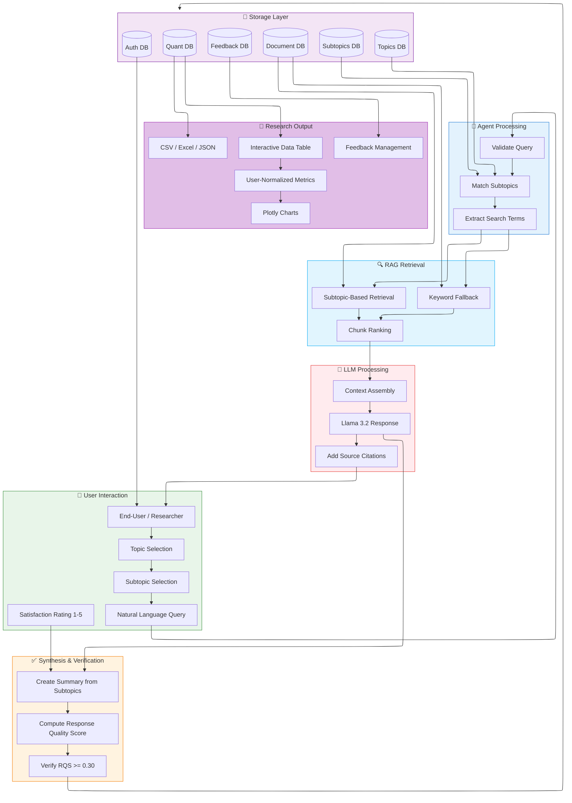
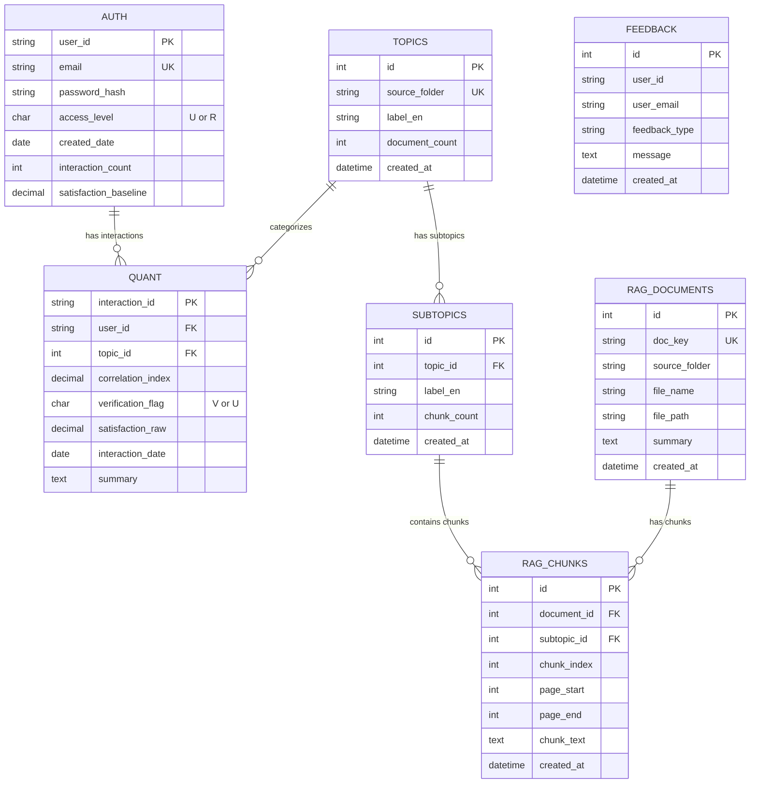

# Quality of Dutch Government - System Architecture

**Institute for Government Quality Research | Utrecht University**

---

## Table of Contents
1. [Front-End Architecture](#front-end-architecture)
2. [Back-End Architecture](#back-end-architecture)
3. [Data Flow Overview](#data-flow-overview)

---

## Front-End Architecture

The front-end is built with Streamlit and provides two distinct user experiences based on role-based access control.

```mermaid
---
config:
  layout: elk
---
flowchart LR
    subgraph Dashboard["🖥️ Streamlit Dashboard"]
        subgraph Auth["🔐 Authentication"]
            Login[Login Page]
            LoginFailed[Invalid Credentials]
            SignUpDialog[Sign Up Dialog]
            DemoCredentials[Demo Credentials Expander]
            RoleCheck{Role Check}
            EndUserRole[End-User Access]
            ResearcherRole[Researcher Access]
        end
        
        subgraph EndUserView["👤 End-User View"]
            subgraph APIStatus["📡 API Status Indicators"]
                AgentStatus[Agent Ready Badge]
                LLMStatus[LLM Ready Badge]
            end
            
            subgraph WelcomeCards["🏠 Welcome Cards"]
                QualityCard[Quality Indicators]
                AuditCard[Audit Reports]
                PolicyCard[Policy Analysis]
            end
            
            subgraph ChatInterface["💬 AI Chat Interface"]
                TopicDropdown[Topic Dropdown]
                SubtopicDropdown[Subtopic Dropdown]
                QueryInput[Natural Language Query]
                ResponseDisplay[LLM Response]
                SourceCitations[Collapsible Source Citations]
            end
            
            subgraph SatisfactionWidget["⭐ Satisfaction Rating"]
                LikertScale[5-Point Likert Scale]
                LikertOptions[Very Dissatisfied → Very Satisfied]
                SubmitRating[Submit Button]
            end
            
            subgraph UserSidebar["📋 User Sidebar"]
                PrivacyNotice[🔒 Privacy Notice Expander]
                ClearChatBtn[Clear Chat Button]
                FeedbackBtnUser[Send Feedback Button]
            end
        end
        
        subgraph ResearcherView["🔬 Researcher View"]
            subgraph Sidebar["🗂️ Sidebar Navigation"]
                DBStatusBadge[DB Connection Badge]
                NavTable[📊 Data Table]
                NavViz[📈 Visualizations]
                NavExport[💾 Export]
                NavFeedback[📝 Feedback]
                FeedbackBtnResearcher[Send Feedback Button]
            end
            
            subgraph TablePage["Page: 📊 Data Table"]
                subgraph TableFilters["Filters & Controls"]
                    DateFilter[Date Range Filter]
                    TopicFilterTable[Topic Filter]
                    UserFilter[User ID Filter]
                    VerificationFilter[Verification Status]
                    SearchBox[Full-Text Search]
                end
                
                subgraph MetricsRow["📈 Summary Metrics"]
                    TotalRecords[Total Records]
                    AvgSatisfactionRaw[Avg. Satisfaction Raw]
                    AvgSatisfactionNorm[Avg. Satisfaction Normalized]
                    AvgQuality[Avg. Quality Score]
                    VerifiedPct[Verified %]
                    UniqueUsers[Unique Users]
                end
                
                DataTable[Interactive Data Table]
                
                subgraph DataColumns["Tracked Metrics"]
                    ColID[ID]
                    ColUserID[User ID]
                    ColDate[Date]
                    ColTopic[Topic]
                    ColSubtopic[Subtopic]
                    ColSatisfactionRaw[Satisfaction Raw 1-5]
                    ColUserNormScore[User-Norm. Score]
                    ColUserTopicQueries[User Topic Queries]
                    ColRQS[Response Quality Score]
                    ColVerified[Verification Flag]
                    ColSource[Source]
                end
            end
            
            subgraph VizPage["Page: 📈 Visualizations"]
                subgraph VizControls["Visualization Controls"]
                    ChartSelector[Chart Type Selector]
                    MetricSelector[Metric Selector]
                    GroupByOptions[Group By Options]
                    DateRangeViz[Date Range]
                end
                subgraph Charts["Interactive Plotly Charts"]
                    TimeSeriesChart[Time Series: Satisfaction Trends]
                    TopicPieChart[Pie: Topic Distribution]
                    SatisfactionHistogram[Histogram: Satisfaction Distribution]
                    BoxPlotTopic[Box Plot: Satisfaction by Topic]
                    CorrelationHeatmap[Heatmap: Topic Correlations]
                    ScatterQuality[Scatter: Satisfaction vs RQS]
                    SourceBarChart[Bar: Source Breakdown]
                end
            end
            
            subgraph ExportPage["Page: 💾 Export"]
                ExportFormat[Format: CSV / Excel / JSON]
                ColumnSelector[Column Selection]
                DateStamp[Automatic Timestamping]
                DownloadBtn[Download Button]
            end
            
            subgraph FeedbackPage["Page: 📝 Feedback Management"]
                FeedbackTypes[Type: Bug / Feature / General / Data Quality / UX]
                FeedbackFilter[Filter by Type & Date]
                CardView[Expandable Card View]
                TableViewFB[Table View]
            end
        end
        
        subgraph FeedbackModal["📝 Feedback Pop-up Modal"]
            FeedbackIntro[Intro Text]
            FeedbackTypeSelect[Feedback Type Dropdown]
            FeedbackTextBox[Text Area - 2000 chars max]
            IncludeUserInfo[Include User Info Checkbox]
            FeedbackSubmit[Submit Button]
            FeedbackCancel[Cancel Button]
        end
        
        subgraph UIDesign["🎨 Design System"]
            UUBranding[UU Yellow #FFCD00]
            DutchBlue[Dutch Blue #1E3A8A]
            DarkGradient[Dark Gradient Background]
            MaterialIcons[Material Design Icons]
            Typography[DM Sans / Space Mono]
            FragmentUpdates[Fragment-Based Updates]
            PulseAnimations[Pulse Animations]
        end
    end
    
    %% Authentication Flow
    Login --> RoleCheck
    Login --> LoginFailed
    Login --> SignUpDialog
    SignUpDialog --> RoleCheck
    DemoCredentials -.-> Login
    RoleCheck --> EndUserRole
    RoleCheck --> ResearcherRole
    EndUserRole --> EndUserView
    ResearcherRole --> ResearcherView
    
    %% End-User Flow
    WelcomeCards -.-> ChatInterface
    TopicDropdown --> SubtopicDropdown
    SubtopicDropdown --> QueryInput
    QueryInput -.-> ResponseDisplay
    ResponseDisplay --> SourceCitations
    ResponseDisplay --> SatisfactionWidget
    SubmitRating -.-> QueryInput
    
    %% Researcher Navigation
    NavTable -.-> TablePage
    NavViz -.-> VizPage
    NavExport -.-> ExportPage
    NavFeedback -.-> FeedbackPage
    
    %% Data Connections
    TableFilters --> DataTable
    MetricsRow --> DataTable
    DataColumns --> DataTable
    VizControls --> Charts
    ColumnSelector --> DownloadBtn
    
    %% Feedback Modal
    FeedbackBtnUser -.-> FeedbackModal
    FeedbackBtnResearcher -.-> FeedbackModal
    
    %% Back-End Connections
    QueryInput -.-o BE_RAG(("→ RAG Pipeline"))
    BE_Response(("← LLM Response")) o-.- ResponseDisplay
    SubmitRating -.-o BE_Synthesis(("→ Synthesis Pipeline"))
    BE_DBQuant(("← DB Quant")) o-.- DataTable
    BE_DBQuant2(("← DB Quant")) o-.- Charts
    BE_Export(("← Export API")) o-.- DownloadBtn
    FeedbackSubmit -.-o BE_Feedback(("→ DB Feedback"))
    
    %% Styling
    style Dashboard fill:#E3F2FD,stroke:#1976D2,stroke-width:2px
    style Auth fill:#FFF3E0,stroke:#F57C00
    style EndUserView fill:#E8F5E9,stroke:#388E3C
    style ResearcherView fill:#F3E5F5,stroke:#7B1FA2
    style ChatInterface fill:#C8E6C9,stroke:#388E3C
    style SatisfactionWidget fill:#DCEDC8,stroke:#689F38
    style UserSidebar fill:#E8F5E9,stroke:#66BB6A
    style APIStatus fill:#E3F2FD,stroke:#1976D2
    style WelcomeCards fill:#FFF8E1,stroke:#FFB300
    style Sidebar fill:#B39DDB,stroke:#673AB7,stroke-width:2px
    style DBStatusBadge fill:#C8E6C9,stroke:#4CAF50
    style TablePage fill:#E1BEE7,stroke:#7B1FA2
    style VizPage fill:#E1BEE7,stroke:#7B1FA2
    style ExportPage fill:#E1BEE7,stroke:#7B1FA2
    style FeedbackPage fill:#E1BEE7,stroke:#7B1FA2
    style TableFilters fill:#D1C4E9,stroke:#9C27B0
    style VizControls fill:#D1C4E9,stroke:#9C27B0
    style DataColumns fill:#F3E5F5,stroke:#9C27B0
    style MetricsRow fill:#E1BEE7,stroke:#7B1FA2
    style Charts fill:#F3E5F5,stroke:#9C27B0
    style FeedbackModal fill:#FFF9C4,stroke:#F57F17,stroke-width:2px
    style UIDesign fill:#FFCD00,stroke:#1E293B,stroke-width:2px
    style LoginFailed fill:#FFCDD2,stroke:#D32F2F
    style SignUpDialog fill:#E3F2FD,stroke:#2196F3
    style RoleCheck fill:#FFE0B2,stroke:#F57C00
    style PrivacyNotice fill:#E8F5E9,stroke:#4CAF50
    style BE_RAG fill:#FFE0B2,stroke:#FF9800
    style BE_Response fill:#FFE0B2,stroke:#FF9800
    style BE_Synthesis fill:#FFE0B2,stroke:#FF9800
    style BE_DBQuant fill:#FFE0B2,stroke:#FF9800
    style BE_DBQuant2 fill:#FFE0B2,stroke:#FF9800
    style BE_Export fill:#FFE0B2,stroke:#FF9800
    style BE_Feedback fill:#FFE0B2,stroke:#FF9800
```



### Front-End Component Summary

| Component | Technology | Purpose |
|-----------|------------|---------|
| Framework | Streamlit | Rapid prototyping, Python-native |
| Charts | Plotly | Interactive visualizations |
| Icons | Material Design | Consistent iconography |
| Styling | Custom CSS | UU branding (#FFCD00), dark theme |
| State | Streamlit Session | Auth, chat history, filters |
| Updates | st.fragment | Prevent full page reloads during chat |

### Implementation Notes

| Page | Data Source | Status |
|------|-------------|--------|
| Data Table | Live database | ✅ Fully implemented |
| Visualizations | Demo data | ⚠️ Database integration pending |
| Export | Live database | ✅ Fully implemented |
| Feedback | Live database | ✅ Fully implemented |

> **Note:** The Visualizations page currently displays demo data for demonstration purposes. Future development will connect it to the live database.

---

## Back-End Architecture

The back-end handles document ingestion, RAG retrieval, LLM integration, and data synthesis for research purposes.

```mermaid
---
config:
  layout: elk
---
flowchart LR
    subgraph IngestionPipeline["📥 Document Ingestion Pipeline"]
        PDFInput[PDF Documents]
        PDFExtract[PyMuPDF / pypdf Extraction]
        SmartChunking[Character-Based Chunking]
        ChunkOverlap[Configurable Overlap]
        DocSummary[LLM Document Summaries]
        TopicClassify[Auto Topic Classification]
        SubtopicGenerate[Subtopic Generation per Document]
        
        PDFInput --> PDFExtract
        PDFExtract --> SmartChunking
        SmartChunking --> ChunkOverlap
        ChunkOverlap --> DocSummary
        DocSummary --> TopicClassify
        TopicClassify --> SubtopicGenerate
    end
    
    subgraph DataSources["📁 Ingested Sources"]
        DefenceReports[Defence Reports - 24 docs]
        ClimateReports[Climate Reports - 11 docs]
        AuditSources[Court of Audit / Auditdienst Rijk / IOB]
    end
    
    SubtopicGenerate --> DocumentDB[(Document Database)]
    DataSources -.-> PDFInput
    
    subgraph RAGSystem["🔍 RAG System"]
        subgraph AgentRouting["🤖 Agent Query Routing"]
            AgentPrompt[Agent System Prompt]
            QueryValidation{Query Valid?}
            SubtopicMatching[Match Subtopic IDs]
            SearchTermExtract[Extract Search Terms]
        end
        
        subgraph RetrievalHierarchy["📊 Retrieval Hierarchy"]
            Level1[1. User Selected Subtopic → Direct]
            Level2[2. Agent Matched Subtopics]
            Level3[3. Topic Keyword Search]
            Level4[4. No Match → Info Message]
        end
        
        subgraph ChunkRetrieval["📄 Chunk Retrieval"]
            RetrieveBySubtopic[retrieve_chunks_by_subtopics]
            KeywordRanking[Keyword Match Scoring]
            ChunkIndexPriority[Early Chunk Priority]
            RetrieveByKeyword[retrieve_chunks Fallback]
        end
        
        subgraph ContextBuilder["Context Building"]
            RelevantChunks[Relevant Chunks - max 15]
            SourceFormatting[Source Formatting]
            ContextWindow[Context Window Assembly]
        end
        
        AgentPrompt --> QueryValidation
        QueryValidation -->|Yes| SubtopicMatching
        QueryValidation -->|No| ErrorResponse[Error Message]
        SubtopicMatching --> SearchTermExtract
        SearchTermExtract --> RetrievalHierarchy
        
        Level1 --> RetrieveBySubtopic
        Level2 --> RetrieveBySubtopic
        Level3 --> RetrieveByKeyword
        
        RetrieveBySubtopic --> KeywordRanking
        KeywordRanking --> ChunkIndexPriority
        ChunkIndexPriority --> RelevantChunks
        RetrieveByKeyword --> RelevantChunks
        RelevantChunks --> SourceFormatting
        SourceFormatting --> ContextWindow
    end
    
    DocumentDB --> AgentRouting
    
    subgraph LLMLayer["🤖 LLM Integration"]
        subgraph OllamaBackend["Ollama Backend"]
            Llama32[Llama 3.2 Model]
            LocalDeployment[Local Deployment]
            ConfigContext[num_ctx: 16384]
            Temperature[temperature: 0.7]
        end
        
        subgraph LLMPrompts["System Prompts"]
            AgentSystemPrompt[Agent: Subtopic Filtering]
            LLMSystemPrompt[LLM: Response Generation]
        end
        
        PromptBuilder[Prompt Construction]
        ChatHistory[Ollama Chat History]
        
        ContextWindow --> PromptBuilder
        PromptBuilder --> Llama32
        LLMSystemPrompt --> Llama32
        ChatHistory <--> Llama32
        Llama32 --> LLMOutput[LLM Response]
    end
    
    FE_Query(("← Front-End Query")) o-.- AgentPrompt
    LLMOutput -.-o FE_Response(("→ Front-End Response"))
    ErrorResponse -.-o FE_Error(("→ Front-End Error"))
    
    subgraph SynthesisPipeline["⚙️ Synthesis Pipeline"]
        UserPrompt[User Prompt]
        LLMResponseCopy[LLM Response]
        MatchedSubtopics[Matched Subtopic Labels]
        SummaryCreate[Create Summary from Subtopics]
        
        UserPrompt --> SummaryCreate
        LLMResponseCopy --> SummaryCreate
        MatchedSubtopics --> SummaryCreate
    end
    
    LLMOutput --> LLMResponseCopy
    
    subgraph VerificationSystem["✅ Verification System"]
        RQSCalculation[Response Quality Score Calculation]
        SourceCount[Source Citation Count +0.05 each]
        ResponseLength[Response Length +0.15/+0.10]
        LexicalOverlap[Lexical Overlap +0.03 each]
        NoRelevantPenalty[No Relevant Penalty -0.20]
        ThresholdCheck{RQS >= 0.30?}
        VerifyPass[Verified ✅ Flag = V]
        VerifyFail[Not Verified ❌ Flag = U]
        
        SummaryCreate --> RQSCalculation
        SourceCount --> RQSCalculation
        ResponseLength --> RQSCalculation
        LexicalOverlap --> RQSCalculation
        NoRelevantPenalty --> RQSCalculation
        RQSCalculation --> ThresholdCheck
        ThresholdCheck -->|Above| VerifyPass
        ThresholdCheck -->|Below| VerifyFail
    end
    
    subgraph DBQuant["📊 Quantitative Database"]
        DBInsert[save_interaction API]
        
        subgraph QuantSchema["Quant Table Schema"]
            SchemaID[interaction_id - PK]
            SchemaUserID[user_id - FK]
            SchemaTopicID[topic_id - FK]
            SchemaDate[interaction_date]
            SchemaSummary[summary - Subtopic Labels]
            SchemaSatisfactionRaw[satisfaction_raw 1-5]
            SchemaRQS[correlation_index]
            SchemaVerified[verification_flag V/U]
        end
        
        VerifyPass --> DBInsert
        VerifyFail --> DBInsert
        DBInsert --> QuantSchema
    end
    
    FE_Satisfaction(("← Front-End Satisfaction")) o-.- DBInsert
    QuantSchema -.-o FE_DataTable(("→ Front-End Data"))
    QuantSchema -.-o FE_Export(("→ Front-End Export"))
    
    subgraph TopicsSubtopics["🏷️ Topics & Subtopics"]
        subgraph TopicsTable["Topics Table"]
            TopicID[id - PK]
            TopicSourceFolder[source_folder]
            TopicLabelEN[label_en]
            TopicDocCount[document_count]
        end
        
        subgraph SubtopicsTable["Subtopics Table"]
            SubtopicID[id - PK]
            SubtopicTopicID[topic_id - FK]
            SubtopicLabelEN[label_en]
            SubtopicChunkCount[chunk_count]
        end
        
        TopicID -.->|FK| SubtopicTopicID
    end
    
    TopicsSubtopics --> AgentRouting
    
    subgraph AuthDatabase["🔐 Authentication Database"]
        subgraph UsersTable["Auth Table"]
            AuthUserID[user_id - PK]
            AuthEmail[email - unique]
            AuthPasswordHash[password_hash - SHA256]
            AuthAccessLevel[access_level U/R]
            AuthCreatedDate[created_date]
            AuthInteractionCount[interaction_count]
            AuthSatisfactionBaseline[satisfaction_baseline]
        end
    end
    
    FE_Login(("← Front-End Login")) o-.- AuthDatabase
    AuthDatabase -.-o FE_AuthResult(("→ Auth Result"))
    AuthUserID -.->|FK| SchemaUserID
    
    subgraph FeedbackDB["📝 Feedback Database"]
        subgraph FeedbackTable["Feedback Table"]
            FeedbackID[id - PK]
            FBUserID[user_id - nullable]
            FBUserEmail[user_email - nullable]
            FBType[feedback_type]
            FBMessage[message]
            FBCreatedAt[created_at]
        end
    end
    
    FE_Feedback(("← Front-End Feedback")) o-.- FeedbackDB
    
    PrivacyNote[/"⚠️ Raw chat content never stored - only subtopic labels"/]
    PrivacyNote -.-> SummaryCreate
    
    %% Styling
    style IngestionPipeline fill:#E8F5E9,stroke:#388E3C
    style DataSources fill:#C8E6C9,stroke:#4CAF50
    style RAGSystem fill:#E3F2FD,stroke:#1976D2
    style AgentRouting fill:#BBDEFB,stroke:#2196F3
    style RetrievalHierarchy fill:#E1F5FE,stroke:#03A9F4
    style ChunkRetrieval fill:#B3E5FC,stroke:#0288D1
    style ContextBuilder fill:#81D4FA,stroke:#0277BD
    style LLMLayer fill:#FFEBEE,stroke:#E53935
    style OllamaBackend fill:#FFCDD2,stroke:#F44336
    style LLMPrompts fill:#EF9A9A,stroke:#E57373
    style SynthesisPipeline fill:#E1BEE7,stroke:#7B1FA2
    style VerificationSystem fill:#FFF3E0,stroke:#F57C00
    style DBQuant fill:#F3E5F5,stroke:#9C27B0
    style QuantSchema fill:#E1BEE7,stroke:#7B1FA2
    style TopicsSubtopics fill:#E0F7FA,stroke:#00ACC1
    style TopicsTable fill:#B2EBF2,stroke:#0097A7
    style SubtopicsTable fill:#80DEEA,stroke:#00838F
    style AuthDatabase fill:#FFF3E0,stroke:#F57C00
    style UsersTable fill:#FFE0B2,stroke:#FF9800
    style FeedbackDB fill:#FFF9C4,stroke:#FBC02D
    style FeedbackTable fill:#FFF59D,stroke:#F9A825
    style DocumentDB fill:#A5D6A7,stroke:#4CAF50
    style QueryValidation fill:#FFF9C4,stroke:#F9A825
    style ThresholdCheck fill:#FFF9C4,stroke:#F9A825
    style VerifyPass fill:#C8E6C9,stroke:#388E3C
    style VerifyFail fill:#FFCDD2,stroke:#D32F2F
    style ErrorResponse fill:#FFCDD2,stroke:#D32F2F
    style PrivacyNote fill:#FFECB3,stroke:#FFA000
    style FE_Query fill:#BBDEFB,stroke:#1976D2
    style FE_Response fill:#BBDEFB,stroke:#1976D2
    style FE_Error fill:#BBDEFB,stroke:#1976D2
    style FE_Satisfaction fill:#BBDEFB,stroke:#1976D2
    style FE_DataTable fill:#BBDEFB,stroke:#1976D2
    style FE_Export fill:#BBDEFB,stroke:#1976D2
    style FE_Login fill:#FFE0B2,stroke:#FF9800
    style FE_AuthResult fill:#FFE0B2,stroke:#FF9800
    style FE_Feedback fill:#FFF59D,stroke:#FBC02D
```



### Back-End Component Summary

| Component | Technology | Purpose |
|-----------|------------|---------|
| LLM | Ollama (Llama 3.2) | Local deployment, response generation |
| PDF Processing | PyMuPDF, pypdf | Text extraction from audit reports |
| Database | SQLite (dev) / PostgreSQL (prod) | Storage for metrics, auth, documents, topics |
| Export | pandas, openpyxl | CSV, Excel, JSON generation |
| RAG | Custom subtopic-based | Efficient retrieval via subtopic filtering |
| Agent | Ollama | Query validation + subtopic matching |

---

## Data Flow Overview



---

## Database Schema



---

## Key Metrics Flow

| Metric | Source | Calculation | Storage |
|--------|--------|-------------|---------|
| **Satisfaction (Raw)** | User rating | Direct 1-5 Likert input | Quant table |
| **Satisfaction (Normalized)** | System | User's avg. per topic (one vote per user-topic) | Calculated on-the-fly |
| **Response Quality Score** | System | `[SOURCE] count × 0.05 + length bonus + overlap - penalties` | Quant table (correlation_index) |
| **Verification Flag** | System | `RQS >= 0.30` → V (Verified), else U | Quant table |

---

## Response Quality Score (RQS) Calculation

```
RQS = min(1.0, max(0.0,
    + min(0.30, [SOURCE] count × 0.05)     # Citation bonus
    + 0.15 if len(response) > 500          # Length bonus
    + 0.10 if len(response) > 1000         # Extra length bonus
    + min(0.30, shared_words × 0.03)       # Lexical overlap
    - 0.20 if "no relevant" in response    # Failure penalty
))
```
